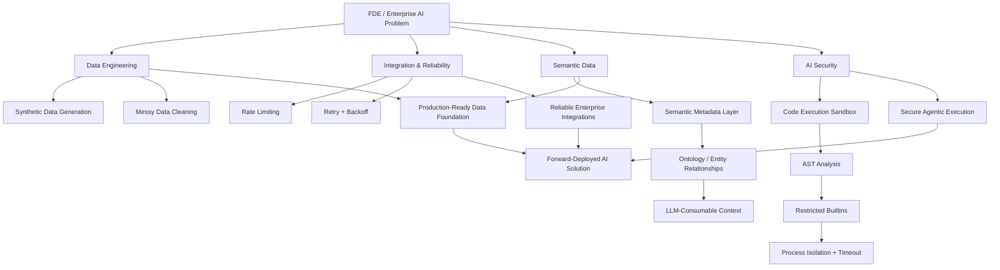
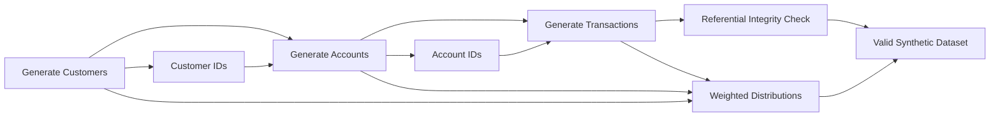
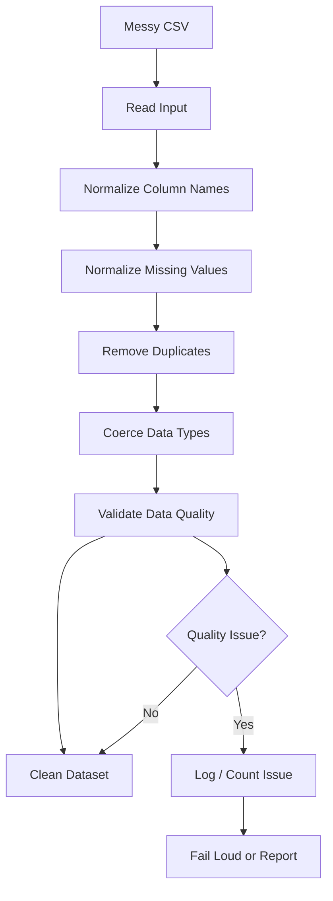
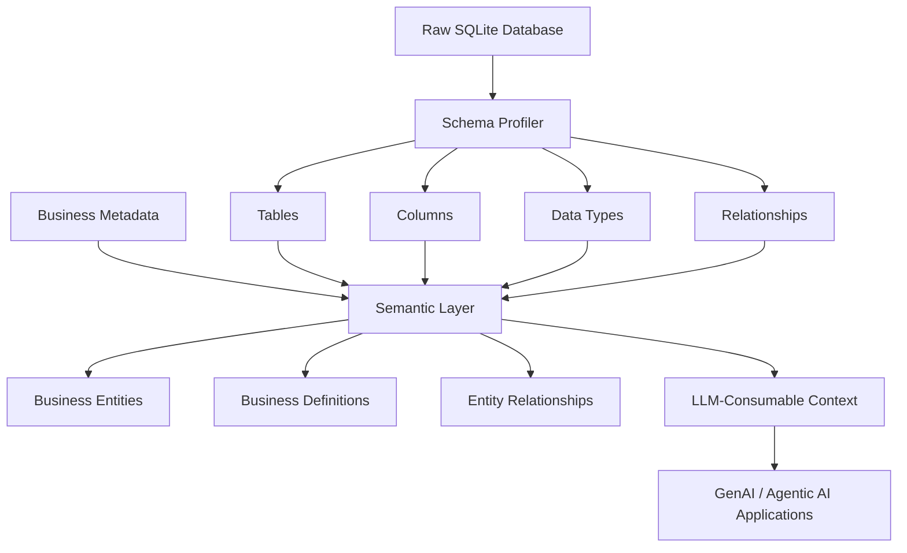
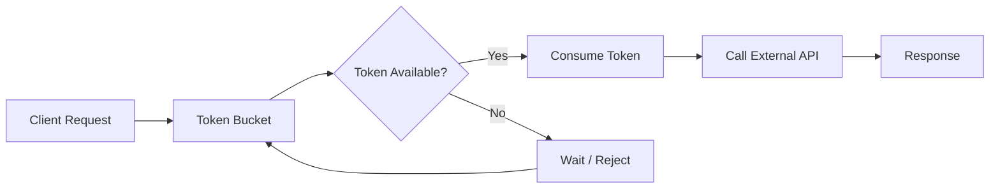
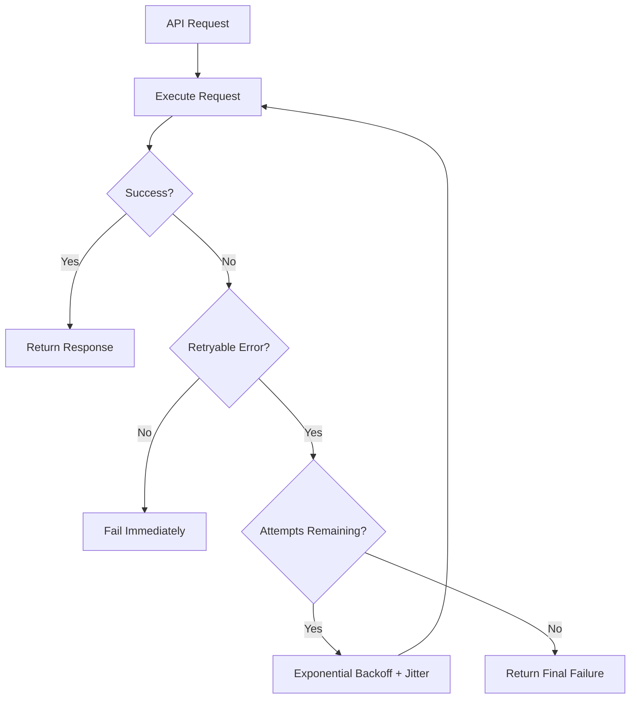
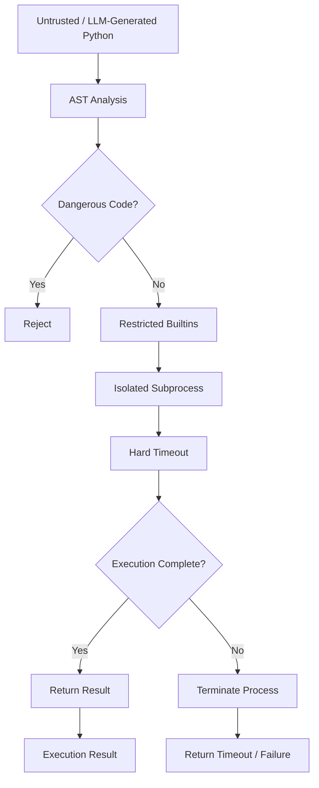
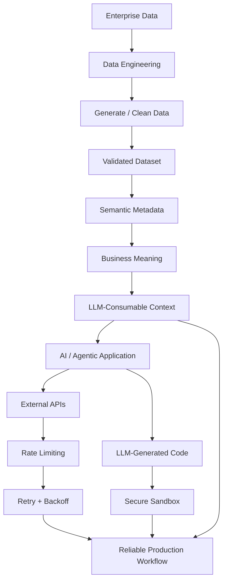

# FDE  — Code Samples

Working, tested Python scripts built for **Google Data FDE (Forward Deployed Engineer)** 

Each script is self-contained, runnable, and includes a demo/test at the bottom:

```python
if __name__ == "__main__":
```

The goal of this repository is to demonstrate practical FDE engineering patterns across **data engineering, semantic data modeling, API integration, reliability, and secure AI execution**.

---

## Capability Map

These scripts are intentionally independent rather than one monolithic application.



This reflects the broader FDE workflow:

**Understand the enterprise problem → build the data foundation → integrate reliably → secure execution → deliver an AI-enabled solution.**

---

## How to run any script

```bash
python3 <folder>/<script_name>.py
```

No external dependencies are required. Everything uses only the **Python standard library**, so the examples can run without:

```bash
pip install
```

---

## Repository structure

```text
fde-interview-prep/
│
├── data-engineering/
│   ├── synthetic_data_generator.py
│   ├── messy_data_cleaner.py
│   ├── semantic_metadata_layer.py
│   └── sample_input.csv
│
├── integration-patterns/
│   ├── rate_limiter.py
│   ├── retry_with_backoff.py
│   └── code_execution_sandbox.py
│
└── README.md
```

---

# Data Engineering

## 1. Synthetic Data Generator

### `data-engineering/synthetic_data_generator.py`

Generates:

```text
Customers
    │
    ├── Accounts
    │      │
    │      └── Transactions
    │
    └── Referential Integrity
```

The generator deliberately creates parent records before child records so that foreign keys always reference existing entities.

### What it demonstrates

- Synthetic data generation
- Parent-before-child generation
- Referential integrity
- Multi-table relationships
- Weighted distributions
- Deterministic/randomized test data
- Scalable test-data generation patterns

### Architecture



### FDE relevance

This maps to the requirement:

> **"Synthetic data generation at scale while maintaining multi-table referential integrity."**

A useful interview explanation:

> **"I generate parent entities first and propagate their IDs to child records. That makes referential integrity an explicit invariant rather than something I hope the random generator maintains."**

---

# 2. Messy Data Cleaner

### `data-engineering/messy_data_cleaner.py`

Cleans deliberately messy CSV data containing issues commonly found in enterprise integrations.

The cleaner handles:

- Inconsistent column naming
- `snake_case`
- `camelCase`
- Spaces in column names
- Missing-value tokens
- `NULL`
- `N/A`
- Empty values
- Duplicate records
- Numeric type coercion

### Architecture



### FDE relevance

This represents a common Forward-Deployed Engineering scenario:

> **"Here is a customer's CSV. Make it usable by our system."**

The important engineering principle is that data quality problems should not silently disappear.

---

# 3. Semantic Metadata Layer

### `data-engineering/semantic_metadata_layer.py`

Profiles a raw SQLite schema and combines the technical schema with human-authored business metadata and entity relationships.

The resulting semantic representation is designed to be consumable by an LLM or downstream AI system.

### Architecture



### Why this matters

Raw database schemas tell an AI system **what exists**.

Semantic metadata can tell it:

- What a customer means
- Which table represents an account
- How entities relate
- Which fields are business metrics
- What terminology the enterprise uses

This creates a bridge between **enterprise data structures and AI reasoning**.

### FDE relevance

This maps directly to:

> **"Integrating semantic metadata formats, enterprise taxonomies, or ontologies into large-scale data warehouses and lakes."**

A strong interview explanation:

> **"The database schema is the technical representation. The semantic layer adds the business meaning that an AI system needs in order to reason over enterprise data correctly."**

---

# Integration Patterns

The integration examples demonstrate the reliability patterns required when connecting AI systems and enterprise applications to external services.

---

# 4. Rate Limiter

### `integration-patterns/rate_limiter.py`

Implements a **token bucket rate limiter**.

The design allows short bursts while enforcing a long-run average request rate.

### Architecture



### Why token bucket?

A token bucket provides a useful balance:

- Sustained traffic stays within the configured rate
- Short bursts can be allowed
- Clients are protected from accidentally overwhelming downstream systems

### FDE relevance

This is a common pattern when integrating with:

- Customer APIs
- LLM APIs
- Enterprise services
- SaaS platforms
- Rate-limited cloud services

A useful interview explanation:

> **"I don't assume an external API can accept unlimited traffic. Rate limiting is part of the integration contract."**

---

# 5. Retry with Exponential Backoff

### `integration-patterns/retry_with_backoff.py`

Retries transient failures using:

- Exponential backoff
- Jitter
- Retryable HTTP errors
- `5xx` responses
- `429 Too Many Requests`
- Per-attempt logging

### Architecture



### Why jitter?

If many clients retry at exactly the same time, they can create another traffic spike.

Jitter spreads retries across time.

### FDE relevance

This demonstrates production thinking around unreliable dependencies.

The important principle is:

> **Retry transient failures, but don't blindly retry everything.**

---

# 6. Secure Code Execution Sandbox

### `integration-patterns/code_execution_sandbox.py`

Provides multiple layers of protection for executing untrusted or LLM-generated Python code.

The sandbox uses defense in depth:

1. Static AST analysis
2. Dangerous import rejection
3. Restricted builtins
4. Subprocess isolation
5. Hard execution timeout

### Architecture



### Defense in depth

No single security mechanism should be treated as sufficient.

```text
AST validation
      +
Restricted builtins
      +
Process isolation
      +
Timeout
      =
Multiple security boundaries
```

This is particularly important when the code originates from an LLM.

### FDE relevance

This maps directly to:

> **"Secure code execution harnesses and interpreter sandboxes."**

A strong interview explanation:

> **"I don't rely on a single security control. The sandbox uses multiple independent layers so that failure of one layer does not automatically expose the host environment."**

---

# Cross-Cutting Design Principles

These principles appear across the repository.

## 1. Parent-before-child generation

Never create a foreign key without sourcing it from an already-generated parent record.

```text
Customer
   ↓
Account
   ↓
Transaction
```

This makes referential integrity an explicit invariant.

---

## 2. Weighted, not uniform, randomness

Real-world data is rarely uniformly distributed.

Instead of:

```python
random.randint(...)
```

the generator uses weighted choices where appropriate:

```python
random.choices(weights=...)
```

This produces more realistic synthetic datasets.

---

## 3. Fail loud, not silent

Data quality issues should be:

- Logged
- Counted
- Reported
- Validated

rather than silently discarded.

This makes production debugging much easier.

---

## 4. Defense in depth

Security controls should be layered.

For example:

```text
Static analysis
      ↓
Restricted execution
      ↓
Process isolation
      ↓
Timeout
```

Each layer addresses a different failure mode.

---

## 5. CLI-first design

Scripts are runnable as standalone tools using `argparse`.

The examples are therefore useful both as:

- Interview coding exercises
- Reusable command-line utilities
- Building blocks for larger systems

---

# How the Patterns Connect

Although the scripts are intentionally independent, they represent complementary pieces of an enterprise AI engineering workflow.



The repository therefore demonstrates a broader engineering lifecycle:

**Data → Semantics → AI → Integration → Reliability → Security**

---

# FDE Problem-Solving Model

The examples can also be viewed through a typical Forward-Deployed Engineer workflow:

```mermaid
flowchart LR
    A["Customer / Business Problem"] --> B["Understand Data"]

    B --> C["Clean / Generate / Validate"]
    C --> D["Add Business Semantics"]

    D --> E["Build AI Capability"]

    E --> F["Integrate Enterprise Systems"]

    F --> G["Add Reliability"]

    G --> H["Add Security"]

    H --> I["Measure / Operate"]

    I --> J["Production Solution"]
```



This is intentionally broader than an individual coding exercise.

An FDE needs to understand the **entire path from customer problem to production system**, including data quality, integration constraints, reliability, and security.

---

# Interview Mapping

| Repository capability | FDE skill demonstrated |
|---|---|
| Synthetic data generation | Data engineering / test data |
| Referential integrity | Data modeling |
| Messy CSV cleaning | Data integration |
| Semantic metadata | Enterprise data semantics |
| Ontology / relationships | Knowledge representation |
| Window / SQL patterns | Analytical data skills |
| Text-to-SQL evaluation | GenAI evaluation |
| Multi-agent RAG | Agentic AI orchestration |
| Rate limiting | API integration |
| Retry + backoff | Reliability engineering |
| Secure sandbox | AI security |
| CLI tools | Practical engineering |

---

# Interview Talking Points

### Data engineering

> **"I built a synthetic data generator that preserves referential integrity across customers, accounts, and transactions while using weighted distributions to produce more realistic data."**

### Data quality

> **"I built a messy-data cleaner because enterprise data rarely arrives in a perfect schema. The pipeline normalizes naming, missing values, duplicates, and types while making quality problems visible."**

### Semantic data

> **"I added a semantic metadata layer on top of the raw database schema so that an AI system can reason about business meaning rather than just table and column names."**

### Reliability

> **"When integrating external systems, I treat rate limits and transient failures as expected conditions. That's why I use token-bucket rate limiting and retry with exponential backoff and jitter."**

### Security

> **"LLM-generated code should be treated as untrusted input. My sandbox uses multiple independent controls—AST validation, restricted builtins, process isolation, and timeouts."**

### Overall FDE mindset

> **"The common theme across these examples is that I don't stop at making the happy path work. I think about data quality, enterprise integration, failure modes, security, and operational behavior."**

---

# Running the Examples

Examples can be run individually.

### Synthetic data

```bash
python3 data-engineering/synthetic_data_generator.py
```

### Messy data cleaner

```bash
python3 data-engineering/messy_data_cleaner.py
```

### Semantic metadata

```bash
python3 data-engineering/semantic_metadata_layer.py
```

### Rate limiter

```bash
python3 integration-patterns/rate_limiter.py
```

### Retry with backoff

```bash
python3 integration-patterns/retry_with_backoff.py
```

### Code execution sandbox

```bash
python3 integration-patterns/code_execution_sandbox.py
```

---

# Design Philosophy

These examples follow a simple principle:

> **Make the happy path work, then deliberately engineer for the conditions that make production systems fail.**

That means considering:

- Data quality
- Referential integrity
- Schema variation
- API rate limits
- Transient failures
- Security boundaries
- Observability
- Maintainability
- Enterprise semantics

This is the mindset I am applying to **Forward-Deployed Engineering for GenAI and Data systems**.
